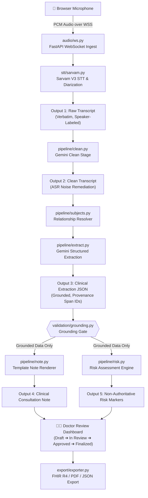

# Svaani AI Medical Scribe: Comprehensive Codebase Documentation

This document serves as an exhaustive, technical overview of the **Svaani AI Medical Scribe** codebase. It contains detailed documentation on the system architecture, file structures, clinical pipelines, data flow, security model, database schema, configuration metrics, and testing infrastructure. It is designed to provide full context to developers, architects, or AI code assistants.

---

## 1. Executive Summary & Core Philosophy

Svaani AI is a production-ready medical scribe system that transcribes doctor-patient consultations, structures clinical information, and generates clinical notes according to structured, regionalized medical templates.

### The Founding Principle: Faithful Scribe, Not Decision Maker
1. **Zero Clinical Invention:** The AI is strictly a documentation assistant. It compiles, cleans, and structures only what was *explicitly spoken* in the consultation. It **never invents** history, vitals, or symptoms.
2. **No Prescriptions:** The system **never authors prescriptions**. Medications discussed are documented verbatim and flagged as non-authoritative (`authoritative=False` is structurally enforced and frozen).
3. **Grounded Outputs:** Every extracted clinical node must list the raw transcript segment IDs (`provenance.span_ids`) from which it was derived. A grounding validator drops or flags any ungrounded assertions.
4. **Human-in-the-Loop:** Clinical notes must transition through a strict review state machine. Only notes manually approved and signed off by the clinician can be exported to EHRs/EMRs.

---

## 2. Architecture & Data Flow

Svaani is designed as a modular monolith in Python (FastAPI backend) and TypeScript/React (Vite SPA frontend). The modules are highly cohesive and decoupled so they can easily be split into microservices.

### System Architecture Flowchart


---

## 3. Directory Layout & Module Specifications

```
svaani--1/
├── app/                      # Main Python Backend Code
│   ├── audio/                # WebSocket audio ingestion and streaming
│   ├── data/                 # Operational data repository layers and PG connection pools
│   ├── eval/                 # Evaluation harnesses and clinical benchmarks
│   ├── export/               # Note exporters (FHIR R4 parser, PDF compiler)
│   ├── llm/                  # LLM integrations (Vertex AI/Gemini clients and protocols)
│   ├── pipeline/             # Multi-stage NLP translation pipelines (clean, extract, risk, note)
│   ├── schemas/              # Pydantic schema contracts for backend operations
│   ├── security/             # Security modules (RBAC, Audit Logger, PHI crypt, startup checkers)
│   ├── storage/              # File storage adapters (Supabase storage)
│   ├── stt/                  # Speech-To-Text client integrations (Sarvam V3 API)
│   ├── templates/            # Dynamic document template engines and registry
│   ├── validation/           # Grounding verification, STT confidence filters, fact checking
│   ├── config.py             # Pydantic base configuration settings
│   ├── logging_config.py     # Application logger configurations (JSON logging / rid injects)
│   ├── logging_service.py    # Analytics database logger (non-blocking, async queue worker)
│   ├── main.py               # Main FastAPI bootstrapper and route registrations
│   ├── store.py              # Session storage protocol definitions
│   ├── store_sql.py          # SQLite persistence store
│   └── store_supabase.py     # Postgres persistence store (Supabase)
├── docs/                     # Architectural design guides and benchmark logs
├── supabase/                 # Database migrations (PostgreSQL tables, functions, and RLS)
├── tests/                    # Pytest test suite (140+ unit/integration tests)
└── web-app/                  # React + Vite TypeScript SPA frontend
```

### Module Breakdown & Core Responsibilities

#### 1. Ingestion (`app/audio/`)
* **`ws.py`**: Manages the binary WebSocket endpoint `/ws/consultation`. Streams raw PCM audio buffers, sends backpressure signals, coordinates real-time streaming segments with Sarvam STT, and initiates the diarized batch-processing pass once the consultation is stopped.

#### 2. Speech-To-Text (`app/stt/`)
* **`sarvam.py`**: Interacts with the Sarvam V3 API (`saaras:v3`). Features a **real-time path** (low-latency segment translation) and a **batch path** (diarization to resolve speaker turns like `speaker_0`, `speaker_1`). Integrates a robust offline fallback to ensure notes are never lost if the external API is unreachable.
* **`doctor_detect.py`**: Implements heuristic analysis to identify who is the physician and who is the patient based on vocal turns, semantic cues, and conversational behavior.

#### 3. LLM Orchestration (`app/llm/`)
* **`base.py`**: Implements the `MedicalLLM` Protocol. Exposes standard, provider-agnostic signatures for text generation, text streaming, and structured schema generation. Supports a `DisabledLLM` mock path to run tests and local servers without active API credentials.
* **`vertex_gemini.py`**: Implements Gemini on Google Vertex AI. Employs *controlled generation* (passing the Pydantic schema class as `response_schema` to Vertex) to guarantee structured JSON output. Integrates dynamic "thinking budget" configuration (setting token limits to `0` on Flash for zero reasoning overhead).

#### 4. The Scribe Pipeline (`app/pipeline/`)
* **`orchestrator.py`**: Coordinates the translation pipeline stages. Runs either a **staged path** (clean ➔ extract ∥ risk concurrently) or a **single-pass path** (combines clean, extract, and risk in one Gemini round-trip via a structured model response to optimize latency).
* **`clean.py`**: Corrects ASR/STT phonetic spelling mistakes using Gemini while preserving the exact numbers, clinical terms, and structure.
* **`subjects.py`**: Resolves who the consultation is about (e.g. diagnosing a parent speaking about a child).
* **`extract.py`**: Compiles verbatim clinical entities from raw text into the `ClinicalExtraction` schema.
* **`note.py`**: Deterministically renders the note based on dynamic hospital templates.
* **`narrate.py`**: Rewrites note sections into fluent clinical prose using Gemini.
* **`risk.py`**: Computes non-authoritative risk scores and extracts evidence spans.

#### 5. Safety & Verification (`app/validation/`)
* **`grounding.py`**: Compares extracted clinical items with the raw clean segment IDs. Any item that cites missing/unheard spans is either dropped or flagged depending on the system policy.
* **`fidelity.py`**: Performs content fact verification. Verifies that medication names and dosages literally appear in the transcript text they cite, protecting against LLM normalization errors.

#### 6. Security & Hardening (`app/security/`)
* **`auth.py`**: Handles authentication. Under `jwt` mode, decodes and verifies JWT access tokens against asymmetric JWKS endpoints or a local shared secret.
* **`rbac.py`**: Maps access privileges dynamically. Enforces granular permissions for different roles (`DOCTOR`, `SCRIBE`, `ADMIN`, `AUDITOR`).
* **`crypto.py`**: Encrypts PHI columns at rest using AES-256-GCM.
* **`audit.py`**: Enforces compliance by recording all security events (e.g., viewing transcripts, changing note states) to an audit log.
* **`startup.py`**: Prevents the application from starting in production with unsafe settings (such as localhost-only CORS, default admin passwords, or unencrypted persistent backends).

---

## 4. Database Schema & Persistence

Svaani isolates operational metadata (reviews, prompts, templates) from active clinical consultations (sessions, extraction logs).

### Storage Engines
1. **`SessionStore` (Clinical Sessions):** Stores `ConsultationSession` records. Can use `memory` (RAM), `sqlite` (local disk with AES-GCM encrypted PHI fields), or `supabase` (Postgres backend with row-level encryption).
2. **`Repository` (Operational Repository):** Manages template definitions, prompt version histories, audits, and dashboard logs. Uses a key-value format `op_records(kind, rid, payload)` to isolate operational schemas from clinical tables.

### Supabase DB Schema (`supabase/schema.sql`)
```sql
-- Core clinical record
CREATE TABLE consultations (
    id UUID PRIMARY KEY DEFAULT gen_random_uuid(),
    practitioner_id UUID REFERENCES auth.users(id),
    hospital_id VARCHAR(50) NOT NULL,
    state VARCHAR(30) NOT NULL, -- listening, processing, draft, in_review, edited, approved, finalized
    session_enc TEXT NOT NULL,  -- AES-GCM encrypted ConsultationSession JSON
    result_enc TEXT,           -- AES-GCM encrypted PipelineResult JSON
    created_at TIMESTAMPTZ DEFAULT clock_timestamp(),
    updated_at TIMESTAMPTZ DEFAULT clock_timestamp()
);

-- Immutable audit logs
CREATE TABLE audit_events (
    id UUID PRIMARY KEY DEFAULT gen_random_uuid(),
    timestamp TIMESTAMPTZ DEFAULT clock_timestamp(),
    actor_id VARCHAR(100) NOT NULL,
    action VARCHAR(100) NOT NULL,
    resource VARCHAR(100) NOT NULL,
    session_id UUID,
    phi_accessed BOOLEAN DEFAULT FALSE,
    detail TEXT
);

-- Deny updates/deletes on audit records to guarantee immutability
CREATE RULE protect_audit_delete AS ON DELETE TO audit_events DO INSTEAD NOTHING;
CREATE RULE protect_audit_update AS ON UPDATE TO audit_events DO INSTEAD NOTHING;
```

---

## 5. Security & RBAC Configuration

Role-Based Access Control permissions are declared statically in `rbac.py`:

```python
class Role(str, Enum):
    DOCTOR = "doctor"
    SCRIBE = "scribe"
    ADMIN = "admin"
    AUDITOR = "auditor"

class Permission(str, Enum):
    VIEW_TRANSCRIPT = "view_transcript"
    EDIT_NOTE = "edit_note"
    APPROVE_NOTE = "approve_note"
    FINALIZE_NOTE = "finalize_note"
    MANAGE_TEMPLATES = "manage_templates"
    EXPORT = "export"
    VIEW_AUDIT = "view_audit"

ROLE_PERMISSIONS = {
    Role.DOCTOR: {
        Permission.VIEW_TRANSCRIPT, Permission.EDIT_NOTE, Permission.APPROVE_NOTE,
        Permission.FINALIZE_NOTE, Permission.EXPORT, Permission.MANAGE_TEMPLATES
    },
    Role.SCRIBE: {
        Permission.VIEW_TRANSCRIPT, Permission.EDIT_NOTE
    },
    Role.ADMIN: {
        Permission.MANAGE_TEMPLATES, Permission.VIEW_TRANSCRIPT, Permission.EXPORT
    },
    Role.AUDITOR: {
        Permission.VIEW_AUDIT, Permission.VIEW_TRANSCRIPT
    }
}
```

---

## 6. Scribe Pipeline Schema Reference

Every stage of the pipeline works with strict data schemas compiled as Pydantic models.

### Raw Transcript Segment (`schemas/transcript.py`)
```python
class TranscriptSegment(BaseModel):
    id: str                    # unique segment id (e.g. seg-0001)
    speaker: SpeakerRole       # doctor, patient, other, unknown
    text: str                  # spoken text
    start_s: float | None = None
    end_s: float | None = None
    confidence: float = 1.0    # STT confidence probability
```

### Medication Mention Contract (`schemas/clinical.py`)
```python
class MedicationMention(BaseModel):
    name: str                  # Verbatim name extracted from transcript
    dose: str | None = None
    route: str | None = None
    frequency: str | None = None
    duration: str | None = None
    verbatim_text: str = ""    # Verbatim transcript span matched
    authoritative: bool = Field(default=False, frozen=True) # Structural safety gate
    provenance: Provenance = Field(default_factory=Provenance)
```

---

## 7. Environment & Configuration Guide

Svaani is configured exclusively through environment variables prefixed with `SCRIBE_`.

| Variable | Type | Default | Purpose / Description |
| :--- | :--- | :--- | :--- |
| `SCRIBE_ENVIRONMENT` | String | `development` | Set to `production` to activate startup blocks on unsafe configuration settings. |
| `SCRIBE_STORE_BACKEND` | String | `memory` | Selected storage adapter (`memory` / `sqlite` / `supabase`). |
| `SCRIBE_AUTH_MODE` | String | `dev` | Authentication method (`dev` for header injection, `jwt` for validated OIDC Bearer tokens). |
| `SCRIBE_PHI_ENCRYPTION_KEY_B64` | String | (empty) | Base64-encoded 32-byte AES-GCM key used for encrypting clinical notes at rest. |
| `SCRIBE_SARVAM_API_KEY` | String | (empty) | Sarvam V3 API credential (mocks active if unset). |
| `SCRIBE_VERTEX_API_KEY` | String | (empty) | Vertex AI/Gemini express-mode API key. |
| `SCRIBE_VERTEX_PROJECT` | String | (empty) | Google Cloud project identifier. |
| `SCRIBE_VERTEX_LOCATION` | String | `asia-south1` | Regional residency location. Sets Mumbai for DPDPA data compliance. |
| `SCRIBE_GEMINI_MODEL` | String | `gemini-3.5-flash` | The primary Google LLM engine. |
| `SCRIBE_SINGLE_PASS_LLM` | Boolean | `True` | Runs clean, extract, and risk steps in a single combined call to optimize latency. |
| `SCRIBE_NARRATIVE_NOTES` | Boolean | `True` | Transforms structured extractions into fluent prose sections. |
| `SCRIBE_DROP_UNGROUNDED_FIELDS` | Boolean | `True` | Automatically drops any extracted item that cannot cite a valid raw transcript segment. |

---

## 8. Test Infrastructure

The codebase maintains a high-quality test coverage (140+ tests) covering backend schemas, database persistence, RBAC permissions, and LLM orchestration.

### Key Test Categories (`tests/`)
1. **`test_pipeline.py`**: Verifies translation stages, grounding logic, and formatting rendering.
2. **`test_hardening.py`**: Verifies AES encryption routines, DB migrations, and JWT token validation.
3. **`test_user_isolation.py`**: Verifies that tenant and physician boundaries cannot be bypassed.
4. **`test_no_rx.py`**: Validates the structural rule preventing the AI from prescribing medications.
5. **`test_clinical_bench.py`**: Benchmarks extraction accuracy and captures recall/precision scores against static golden transcript datasets.
