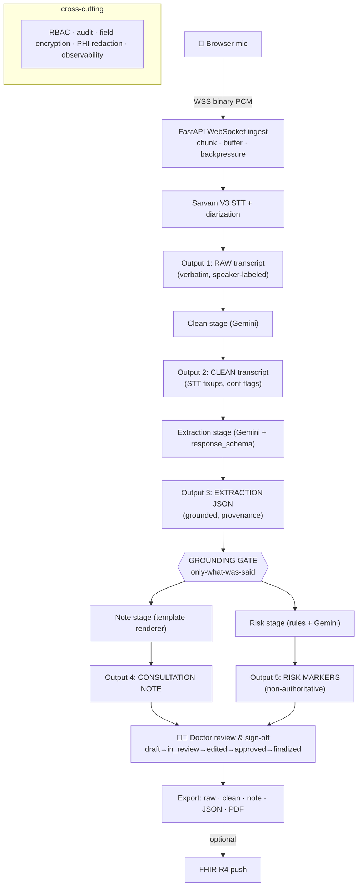
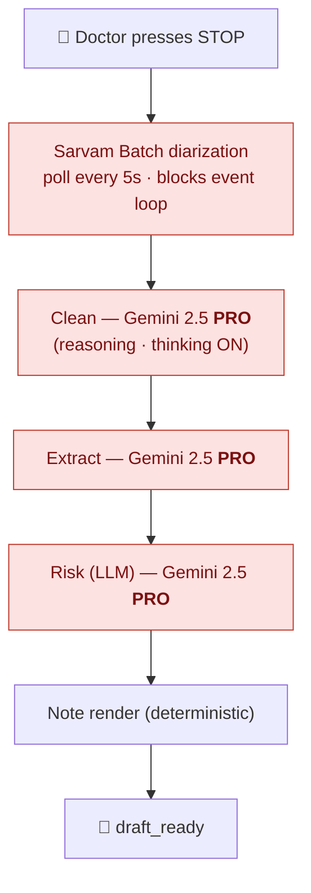
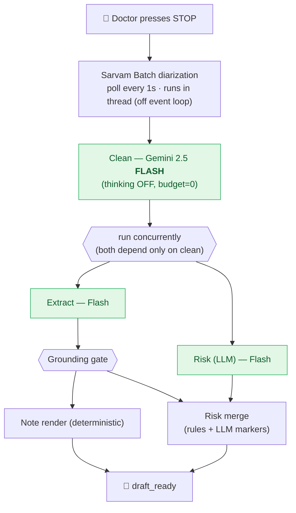

# AI Medical Scribe — Production Architecture

> **Founding principle:** the AI is a **faithful scribe, not a clinical
> decision-maker**. It transcribes, cleans, and *structures only what was actually
> said*. It never invents symptoms, never suggests treatments, and **never authors
> prescriptions**. Its sole intelligence add-on is a *non-authoritative* risk-marker
> layer that flags indications already present in the conversation for the doctor.

---

## 0. The core problem — why `Audio → STT → LLM → Structured Output` is insufficient

The naïve pipeline is unsafe and lossy for hospital use. Each weakness below maps to
a concrete mechanism in this design.

| # | Weakness of the naïve flow | Our mechanism |
|---|---|---|
| 1 | **LLM over-reach** — even structuring (not "creating") can infer beyond what was said | **Grounding + provenance + verification** ([`validation/grounding.py`](../app/validation/grounding.py)): every field cites a transcript span; ungrounded items dropped/flagged |
| 2 | **Silent STT errors** propagate misheard drugs/numbers | Dedicated **clean stage** + **confidence gating** ([`pipeline/clean.py`](../app/pipeline/clean.py), [`validation/confidence.py`](../app/validation/confidence.py)) |
| 3 | **No speaker attribution** | **Sarvam Batch-API diarization** → `TranscriptSegment.speaker` (real-time/stream are unlabeled; batch gives doctor/patient labels) |
| 4 | **No human-in-the-loop** | **Review state machine** ([`schemas/session.py`](../app/schemas/session.py)); only FINALIZED is exportable |
| 5 | **No traceable intermediate** | **Grounded extraction JSON** sits between transcript and note |
| 6 | **No risk surfacing** | **Risk markers / score** ([`pipeline/risk.py`](../app/pipeline/risk.py)) with evidence spans |
| 7 | **Fixed format** | **Dynamic template engine** ([`templates/`](../app/templates/)) |
| 8 | **Multilingual/code-mix loss** | Per-segment language + confidence from Sarvam; clean stage preserves meaning |
| 9 | **No partial/correction mgmt** | WebSocket partial/final + correction merge ([`audio/ws.py`](../app/audio/ws.py)) |
| 10 | **PHI exposure** | Redaction, field encryption, regional Vertex, RBAC, audit ([`security/`](../app/security/)) |
| 11 | **No failure handling** | Escalation state; bounded retries; no silent blanks |
| 12 | **No provenance/confidence** | `Provenance{span_ids, confidence, grounded}` on every item |

**Removed by design:** AI-authored prescriptions. **"Safe validation" = "only what was
mentioned"**, enforced mechanically by grounding — *not* AI dosage/interaction generation.

---

## 1. Executive summary

Karaionyx converts a doctor–patient conversation into a reviewable, auditable clinical
record while guaranteeing the AI adds no clinical content of its own. Audio streams over
a WebSocket to **Sarvam V3** (`saaras:v3`, multilingual ASR → English). Speaker
diarization (doctor/patient) comes from Sarvam's **Batch API** at end-of-consult; the
live real-time/streaming path gives an immediate but unlabeled transcript. A
staged pipeline then produces five artifacts — raw transcript, clean transcript, grounded
clinical-extraction JSON, a **template-driven** consultation note, and a non-authoritative
risk-marker layer. **Gemini on Vertex AI** performs the language understanding under
*controlled generation* so its output validates against our Pydantic schemas; a grounding
gate then proves every field traces to a real utterance. A doctor reviews, edits, approves,
and signs; only then can the record be exported (PDF/JSON) or pushed to an EHR.

The design is greenfield Python/FastAPI, structured as a modular monolith with clean
module seams so any stage can later become its own service.

---

## 2. Recommended architecture diagram



Pipeline orchestration is in [`pipeline/orchestrator.py`](../app/pipeline/orchestrator.py);
grounding runs **between** extraction and note so the note is built only from grounded items.

---

## 2.1 Latency optimization — before vs now

The end-to-end wait the doctor sees is everything that happens **after `stop`**:
batch STT → the LLM pipeline → note. The original design paid that bill serially on a
reasoning model; the current design parallelizes the independent stages and uses a
fast structuring model with "thinking" disabled. The diagrams below contrast the
**critical path** (the chain of work that actually determines wall-clock time).

### Before — serial, reasoning model, blocking



**Critical path:** `STT(poll≤5s) + Pro(clean) + Pro(extract) + Pro(risk) + render`
— **three sequential Pro round-trips**, each carrying thinking-token latency, run
inline on the async event loop (the socket can't even answer `ping` meanwhile).

### Now — parallel, fast model, thinking off, off-loop



**Critical path:** `STT(poll≤1s) + Flash(clean) + max(Flash extract, Flash risk) + render`
— **one Flash call, then two in parallel**, no thinking tokens, run in a worker
thread so the WebSocket stays live and concurrent consults no longer serialize.

### What changed (and where)

| Lever | Before | Now | Where |
|---|---|---|---|
| Model | `gemini-2.5-pro` (reasoning) | `gemini-2.5-flash` | [`config.py`](../app/config.py), `SCRIBE_GEMINI_MODEL` |
| Thinking | on | `thinking_budget=0` (off) | [`config.py`](../app/config.py), [`llm/vertex_gemini.py`](../app/llm/vertex_gemini.py) |
| Extract + LLM-risk | sequential | **parallel** (both need only `clean`) | [`pipeline/orchestrator.py`](../app/pipeline/orchestrator.py), [`pipeline/risk.py`](../app/pipeline/risk.py) |
| STT poll cadence | every 5 s | every 1 s (configurable) | [`config.py`](../app/config.py), [`stt/sarvam.py`](../app/stt/sarvam.py) |
| Execution | inline (blocks event loop) | `asyncio.to_thread` | [`audio/ws.py`](../app/audio/ws.py), [`main.py`](../app/main.py) |

All five are tuning/structure changes — the **safety contract is unchanged**: grounding
still runs between extraction and note, risk markers stay non-authoritative, and the
keyless mock / `DisabledLLM` fallbacks behave exactly as before. The remaining dominant
cost is the **batch diarization job itself**; removing it needs the streaming redesign
(§4 *Streaming vs batch*), not a tuning change.

---

## 3. Service / module breakdown

| Module | Responsibility | Key files |
|---|---|---|
| **audio** | WebSocket ingest, chunk/buffer/backpressure, event protocol | `audio/ws.py` |
| **stt** | Sarvam V3 (`saaras:v3`): real-time transcribe + Batch-API diarization + fallback; mock | `stt/sarvam.py` |
| **llm** | `MedicalLLM` protocol; Gemini-on-Vertex; disabled fallback | `llm/base.py`, `llm/vertex_gemini.py` |
| **pipeline** | clean → extract → note → risk; orchestrator | `pipeline/*.py` |
| **templates** | component catalog, versioned registry, deterministic renderer | `templates/registry.py`, `templates/renderer.py` |
| **validation** | grounding ("only what was said"), STT-confidence gating | `validation/grounding.py`, `validation/confidence.py` |
| **schemas** | Pydantic contract for all 5 outputs + template + session | `schemas/*.py` |
| **security** | RBAC, append-only audit, AES-GCM field encryption, PHI redaction | `security/*.py` |
| **export** | raw/clean/note/JSON/PDF; FHIR hook | `export/exporter.py`, `export/pdf.py` |
| **store** | session + result persistence (in-memory scaffold) | `store.py` |
| **main** | FastAPI app, REST routes, WS route, auth dependency | `main.py` |

Boundaries are deliberately service-shaped: each maps cleanly to a future microservice
(audio-gateway, stt-engine, clinical-nlp, template-service, export-service) communicating
over an event bus, mirroring the proven Svaani topology.

---

## 4. FastAPI + WebSocket design

**Session lifecycle** (`schemas/session.py`): `LISTENING → PROCESSING → DRAFT → IN_REVIEW
→ EDITED → APPROVED → FINALIZED` (+ `ESCALATION_REQUIRED`). Illegal transitions raise; the
only path to FINALIZED is through APPROVED (human sign-off).

**WebSocket** `/ws/consultation` (`audio/ws.py`):
- **Inbound:** binary frames = audio bytes (appended to a per-session buffer); text frames
  = JSON control (`start` / `stop` / `ping`).
- **Outbound JSON events:** `stage_update`, `final_segment` (with `speaker`, `span_id`,
  `confidence`), `risk_warning`, `draft_ready` (note markdown + grounding report), `error`.
- **Streaming vs batch:** the scaffold transcribes at `stop` (batch); production pushes
  chunks to Sarvam's streaming endpoint and emits `partial_transcript` live. Backpressure
  hook is marked where the buffer is filled.
- **Resumability:** `session_id` keys the buffer/state so a dropped socket can reconnect.

**REST** (`main.py`): `/health`; `/templates`, `/templates/components`,
`/templates/{id}`; `/sessions` (create), `/sessions/{id}/transcript` (process a supplied
transcript), `/sessions/{id}/simulate` (canned/live STT smoke), `/sessions/{id}` (status),
`/sessions/{id}/outputs/{kind}`, `/sessions/{id}/state` (review transitions),
`/sessions/{id}/export/{fmt}`. Auth is a header-driven `Principal` in the scaffold; replace
with verified OIDC/JWT (Keycloak) in production.

---

## 5. Dynamic template engine design

**Component catalog** (`schemas/template.ComponentType`): Patient Information, Chief
Complaints, HPI, Past Medical History, Family History, Allergies, Vitals, Examination,
Investigations, Assessment, Diagnosis, Treatment Plan, Follow-up, Doctor Notes, Custom.
*(No `PRESCRIPTION` component — the AI does not author prescriptions.)*

**Template JSON** (the drag-and-drop builder's contract):
```json
{ "template_id": "ent", "name": "ENT Template", "version": 1, "hospital_id": "hosp_c",
  "sections": [
    {"id":"chief_complaints","component":"CHIEF_COMPLAINTS","label":"Chief Complaints","enabled":true,"order":2},
    {"id":"nose","component":"CUSTOM","label":"Nose Findings","enabled":true,"order":5,"schema_hint":"examination.nose"}
  ]}
```
Each section is **enabled / reordered / renamed**; `CUSTOM` sections bind to a dotted
`schema_hint` into the extraction (e.g. `examination.nose`).

- **Registry** (`templates/registry.py`): loads versioned templates from
  `docs/templates/*.json` (a DB in production), keyed by `(template_id, version)`;
  `register` adds a *new* version rather than mutating.
- **Renderer** (`templates/renderer.py`): **pure, deterministic, LLM-free** — it only
  formats grounded extraction items, so the note asserts nothing extra. Provenance is
  aggregated per section.
- **Versioning:** immutable per version; finalized notes pin `template_id@version`.
- Four examples ship: `soap`, `ent`, `ortho`, `freeform`. The ENT template reproduces the
  brief's example (regional throat/nose/ear findings) — see `tests/test_templates.py`.

---

## 6. Pydantic schema design

All schemas are Pydantic v2 (`schemas/`). Highlights:

- **Provenance** `{span_ids, confidence, grounded, note}` — the traceability unit; attached
  to every extracted item.
- **ClinicalExtraction** — `chief_complaints[]`, `examination[]` (as `ExaminationFinding`
  with a `examination_nested()` view matching the brief), `medications_discussed[]`
  (`MedicationMention`, **`authoritative` hard-coerced to `False`** via a field validator
  *and* `frozen`), grounded free-text fields, etc. `to_data_map()` powers `schema_hint`
  resolution.
- **RiskAssessment / RiskMarker** — `evidence_span_ids`, severity, `authoritative=False`
  (validator-enforced).
- **TemplateDefinition / TemplateSection** — `CUSTOM` requires `schema_hint`; unique
  section ids; `active_sections()` ordering.
- **ConsultationNote / NoteSection** — sectioned, provenance-bearing, `to_markdown()`.
- **ConsultationSession** — holds all five outputs + the review state machine.

Gemini's **controlled generation** uses these models directly as `response_schema`
(`llm/vertex_gemini.py`), so the LLM output is schema-valid before it ever reaches the
grounding gate.

---

## 7. Security architecture

PHI is handled end to end. (Greenfield mirrors Svaani's proven controls.)

- **Encryption in transit:** TLS 1.3 / WSS everywhere; mTLS between internal services.
- **Encryption at rest:** AES-256-GCM **field-level** encryption for PHI
  (`security/crypto.py`); key from Vault/KMS via `SCRIBE_PHI_ENCRYPTION_KEY_B64`.
- **RBAC** (`security/rbac.py`): roles `doctor / scribe / admin / auditor` → permission
  sets; every PHI route is permission-checked. Production: Keycloak OIDC/JWT.
- **Audit** (`security/audit.py`): append-only events for every PHI access and state
  transition; point at a WORM/Kafka `audit.events` sink in production.
- **PHI redaction** (`security/redact.py`): Presidio when installed, regex fallback
  otherwise — applied before external calls where minimization is required.
- **Data residency:** Vertex pinned to `asia-south1` (Mumbai) keeps inference in-country;
  configure Vertex **no-training** + a Google BAA.
- **Compliance posture:** HIPAA (US) — BAA, audit, encryption, minimum-necessary, access
  controls; **India DPDPA / ABDM** — in-country processing, consent, purpose limitation,
  data-principal rights; clinical-software lifecycle per **IEC 62304** (risk file, SRS,
  validation) as in Svaani's `docs/iec62304/`.

---

## 8. Validation framework

Three layers, all subordinate to "only what was said":

1. **Grounding** (`validation/grounding.py`) — the core safety gate. Every extracted item
   must cite transcript span(s) that exist; ungrounded items are **dropped** (default) or
   **flagged** (`SCRIBE_DROP_UNGROUNDED_FIELDS=false`). Returns a `GroundingReport`
   (`kept / dropped / flagged`). A Verifier-style LLM cross-check (à la Svaani's
   `VerifierAgent`) is the production extension that confirms the note asserts nothing
   beyond the clean transcript.
2. **STT-confidence gating** (`validation/confidence.py`) — flags low-confidence spans
   (drug names, numbers) for reviewer attention; seeds `LOW_STT_CONFIDENCE` risk markers.
3. **Risk markers** (`pipeline/risk.py`) — rule-based baseline (red-flag phrases, allergy
   mentions, dosage patterns, mentioned medications, low-confidence spans) merged with
   optional Gemini findings; **never authoritative**, always carries evidence spans.

What we deliberately **do not** do: generate prescriptions, compute dosages, or assert
drug–drug interactions as clinical truth. Mentioned drugs/allergies surface as *flags for
the human*, not as decisions.

---

## 9. Download & export framework

`export/exporter.py` + `export/pdf.py`, exposed via `GET /sessions/{id}/export/{fmt}`,
gated on `is_exportable` (FINALIZED only) and `EXPORT` permission, and audited.

| Format | Source | Notes |
|---|---|---|
| Raw transcript | `export_raw` | verbatim text |
| Clean transcript | `export_clean` | corrected text |
| Consultation note | `export_note_markdown` | template-rendered Markdown |
| Extraction JSON | `export_extraction_json` | grounded structured data |
| Full record | `export_record` | all outputs + provenance + risk + state |
| PDF | `note_to_pdf` | reportlab (pure-Python; no system deps) |
| FHIR R4 | (hook) | DocumentReference/Composition push to EHR |

---

## 10. Final technology recommendations

| Layer | Choice | Rationale |
|---|---|---|
| API / WS | **FastAPI + Uvicorn** | async WS, Pydantic-native, typed |
| STT | **Sarvam V3 (`saaras:v3`)** | multilingual Indian + code-mix → English; real-time/stream (immediate, unlabeled) + **Batch API** (diarized doctor/patient labels + timestamps) |
| Medical LLM | **Gemini `gemini-2.5-pro` on Vertex** | express API-key auth; `response_schema` controlled generation; `asia-south1` for project-auth residency; BAA. Swappable via `MedicalLLM`. See `docs/llm-comparison.md` |
| Schemas | **Pydantic v2** | one contract for validation + LLM controlled generation |
| PDF | **reportlab** | pure-Python, Windows-friendly |
| Encryption | **AES-256-GCM** (`cryptography`) | field-level PHI at rest |
| PHI detection | **Presidio** (optional) | regex fallback bundled |
| IAM (prod) | **Keycloak** OIDC/JWT | replaces the scaffold header auth |
| Secrets (prod) | **Vault / KMS** | encryption keys, Sarvam/Vertex creds |
| Bus (prod) | **Kafka** | stage decoupling, DLQ, audit topic |

---

## 11. Risks and mitigations

| Risk | Mitigation |
|---|---|
| LLM infers content not said | Grounding gate drops/flags ungrounded items; provenance on every field |
| STT mis-hears drug/number | Clean stage + confidence gating + reviewer flags; never auto-finalized |
| Misattributed speaker | Sarvam diarization; speaker shown per segment in review |
| PHI leak to third party | Redaction, regional Vertex + no-training + BAA, field encryption, audit |
| Doctor over-trusts AI | No prescriptions; risk markers explicitly non-authoritative; mandatory sign-off |
| Silent failure → blank record | Escalation state, bounded retries, no silent blanks (Svaani ADR-013) |
| Template drift breaks old notes | Immutable versioning; finalized notes pin `template_id@version` |
| Prompt injection via transcript | Transcript passed as *data only*; system instruction is authoritative; control chars sanitized |
| Vendor lock-in | `MedicalLLM` protocol + STT interface keep providers swappable |

---

## 12. Production deployment strategy

1. **Packaging:** container per module (audio-gateway, stt, clinical-nlp/pipeline,
   template-service, export). Distroless images; non-root.
2. **Orchestration:** Kubernetes + Helm; HPA on the pipeline/LLM workers; Istio mTLS;
   Vault sidecar for secrets (mirrors Svaani's `deploy/helm`).
3. **Event backbone:** Kafka topics per stage with DLQs; `audit.events` to WORM storage.
4. **Data:** encrypted Postgres for sessions/templates/audit; object store for audio
   (zero-retention/TTL by policy); Redis for live session/audio buffering.
5. **Observability:** OpenTelemetry traces across stages; Prometheus/Grafana; structured
   JSON logs with `session_id` correlation (never log raw PHI).
6. **CI/CD:** lint + type-check + `pytest` (incl. grounding/no-Rx gates) as a merge gate;
   image scanning (Trivy); staged rollout (staging → canary → prod).
7. **Regional residency:** deploy in an India region; Vertex `asia-south1`; data-locality
   network policies; DPDPA/ABDM controls.
8. **Clinical governance:** IEC 62304 lifecycle, a documented clinical validation study
   (WER, entity F1, grounding precision, reviewer-edit rate) before go-live, and a
   human-in-the-loop SLA — no note is finalized without a clinician.

---

## 13. v2 — real-time, single-pass, hardened (current build)

The architecture above still holds; v2 makes it **real-time and production-shaped** while
keeping every safety guarantee (grounding, fact verification, no-Rx, human sign-off).

**Real-time streaming consult** ([`audio/ws.py`](../app/audio/ws.py), [`stt/sarvam_stream.py`](../app/stt/sarvam_stream.py))
- Browser streams 16 kHz PCM over the WebSocket → **Sarvam streaming STT** (`saaras:v3`)
  → live `final_segment` events sub-second. On `stop`, the buffered audio runs the
  **batch-diarized** pass to recover doctor/patient labels (streaming has no diarization)
  — a hybrid: live feedback + accurate final labels. Degrades to batch-at-stop, and to
  the live segments if diarization fails (the note is never blocked). Flag: `SCRIBE_STREAMING_STT`.

**Single-pass LLM** ([`pipeline/combined.py`](../app/pipeline/combined.py))
- Clean + extract + risk are produced in **one** Gemini call (was 3), with automatic
  fallback to the staged path. Note narration is **streamed token-by-token** to the UI
  (`note_chunk` events, [`pipeline/narrate.py`](../app/pipeline/narrate.py)). Model:
  **`gemini-3.5-flash`** (~3× faster than 2.5-flash here). Flag: `SCRIBE_SINGLE_PASS_LLM`.

**Content-level fact verification** ([`validation/fidelity.py`](../app/validation/fidelity.py))
- Grounding proves a cited span *exists*; fidelity proves the medication **name/dose was
  actually said** in it — catching a model that normalized `1 mg`→`40 mg` or renamed a drug.
  Mismatches surface in the Grounding tab; nothing is silently trusted.

**Structured editing** — `PUT /sessions/{id}/extraction` and `/risk` (plus the existing
note edit) let the clinician add/remove/edit items; an extraction edit re-renders the note
and re-verifies against the transcript.

**Interop & coding** — `GET /sessions/{id}/export/fhir` emits a **FHIR R4** document Bundle
([`export/fhir.py`](../app/export/fhir.py)); `GET /sessions/{id}/coding` returns grounded,
non-authoritative **ICD-10** hints ([`pipeline/coding.py`](../app/pipeline/coding.py)).

**Hardening**
- **Durable encrypted store** ([`store_sql.py`](../app/store_sql.py)): SQLite with PHI
  encrypted at rest via `FieldCipher`; same `get_store()` interface. Flag: `SCRIBE_STORE_BACKEND=sqlite`.
- **Auth** ([`security/auth.py`](../app/security/auth.py)): `SCRIBE_AUTH_MODE=jwt` requires a
  verified bearer (HS256 secret or RS256/JWKS for Keycloak); `dev` keeps the header scaffold.
- **Observability** ([`observability.py`](../app/observability.py)): Prometheus `/metrics`
  (per-route latency histograms) + `X-Request-ID` propagation + access logs.
- **Docker**: multi-stage `Dockerfile` (build SPA → serve with the API) + `docker-compose.yml`.

**Frontend** — a Vite + React + TypeScript SPA in [`web-app/`](../web-app) (served at `/app`,
the default): live transcript pane, streaming note, real-time risk, the structured editors,
and sign-off. The legacy static UI remains at `/ui` as a fallback.
