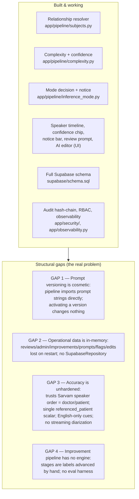

# Svaani AI Medical Scribe — Intelligent Redesign (Design Document)

> **Status:** Design proposal for review. **No code has been changed.** Implementation
> begins only after this document is approved (see the approved plan).

## 0.1 Who this is for

This document is the design deliverable for hardening the Svaani scribe to **benchmark-level
clinical accuracy in multi-speaker consultations** while keeping the existing low-latency,
real-time UX. It is written for the engineer who will implement it, the clinician who relies
on the output, and the admin/auditor who governs quality.

The 16 requested deliverables are split across these files:

| # | Deliverable | File |
|---|-------------|------|
| 1 | Updated system architecture | `01-system-architecture.md` |
| 2 | Backend architecture | `01-system-architecture.md` |
| 3 | Frontend flow | `02-frontend-flow.md` |
| 4 | UI wireframes | `02-frontend-flow.md` |
| 5 | Database schema | `03-data-model.md` |
| 6 | Event flow diagrams | `04-event-and-sequence-diagrams.md` |
| 7 | API design | `05-api-design.md` |
| 8 | Sequence diagrams | `04-event-and-sequence-diagrams.md` |
| 9 | AI orchestration workflow | `01-system-architecture.md` §1.4 |
| 10 | Feedback learning pipeline | `06-feedback-and-improvement-pipeline.md` |
| 11 | Admin dashboard design | `07-admin-dashboard.md` |
| 12 | Deployment strategy | `08-nonfunctional.md` §8.1 |
| 13 | Scalability considerations | `08-nonfunctional.md` §8.2 |
| 14 | Security recommendations | `08-nonfunctional.md` §8.3 |
| 15 | Performance optimization | `08-nonfunctional.md` §8.4 |
| 16 | Risks and mitigation | `08-nonfunctional.md` §8.5 |

## 0.2 The problem, precisely

The system is accurate with one speaker and **degrades when several people talk**. The canonical
failure:

```
Doctor:  What happened?
Mother:  Doctor, my son has had fever for three days.
Doctor:  Is he vomiting?
Mother:  Yes, twice.
```

A naive scribe records **Patient = Mother**. The correct reading is **Patient = Son**,
**Speaker 2 = Caregiver (Mother)**. The system must reason about *relationships* — "whose symptoms
are these?" — not assign the illness to whoever is talking.

## 0.3 What already exists (and why it isn't enough)

A prior build already scaffolds most of the 13 goals. Exploration of the codebase found the
machinery present but with **three structural gaps** that make the intelligent features ineffective:



| Gap | Evidence | Consequence |
|-----|----------|-------------|
| **1. Versioning inert** | `app/pipeline/{combined,clean,extract,risk}.py` and `subjects.py:20` import constants from `app/pipeline/prompts.py`; the `prompt_versions` row's docstring even claims "Only `active` is read by the pipeline" — but nothing reads it. | Admins can "activate" prompts with zero effect. Goals 9 & 10 are decorative. |
| **2. No persistence** | `app/data/repo.py` is a pure in-RAM `Repository`; `get_repo()` never branches on `SCRIBE_STORE_BACKEND`. Only the *session* store (`app/store_supabase.py`) is wired. | Reviews, admin queue, improvement items, prompt/model versions, edit history, and flags vanish on restart. Goals 7–11 + 13-flags don't survive. |
| **3. Accuracy fragile** | `app/stt/sarvam.py:34-47` maps first-seen speaker → DOCTOR, second → PATIENT. `ConversationProfile.referenced_patient` is a single scalar. `_CUES` in `subjects.py` are English regex. Streaming STT has no diarization. | If the patient speaks first, or a translator/interpreter leads, or two family members each describe different people, attribution breaks. |
| **4. Pipeline hollow** | `ImprovementStage` has `regression_test_generation`, `prompt_optimization`, `offline_validation`, but `advance_improvement()` just increments the stage index. | "Continuous improvement" cannot actually validate a candidate prompt. |

## 0.4 Design principles (carried forward, do not break)

1. **Faithful scribe, never an author.** The system transcribes, cleans, and *structures* only
   what was said. It never invents symptoms, recommends treatment, or authors a prescription
   (`SCRIBE_SYSTEM` in `app/pipeline/prompts.py`). The intelligence layer only answers *who*
   and *how confident* — never *what is wrong with the patient*.
2. **Two layers everywhere: deterministic + LLM.** Every stage has a rule-based path that works
   with no LLM (drives the mock and tests) and an optional LLM pass that sharpens it. The LLM
   must never *block* the note (`resolve_relationships` swallows LLM errors).
3. **Everything is grounded.** Every extracted item cites transcript `span_ids`; ungrounded items
   are flagged or dropped (`app/validation/grounding.py`).
4. **PHI is encrypted at rest, queryable metadata is not.** Clinical content lives in `*_enc`
   AES-256-GCM columns; only non-PHI signals (complexity, mode, confidence, versions) are plain.
5. **Latency budget is sacred.** Simple consults must stay real-time. New intelligence runs on the
   transcript we already have (no extra round-trips for the common case) or asynchronously.
6. **Humans gate prompts.** No prompt is ever modified automatically in production. Every change is
   versioned, evaluated offline, and human-approved before deployment.

## 0.5 Target state in one sentence

Every one of the 13 goals becomes **connected** (the active prompt version actually drives the model),
**persistent** (operational data lives in Supabase), and **hardened** (the resolver detects the doctor
by behavior, supports multiple referenced patients, and degrades gracefully), governed by a real
offline regression-eval harness with human-gated deployment.

See `01-system-architecture.md` for how the pieces fit together.
