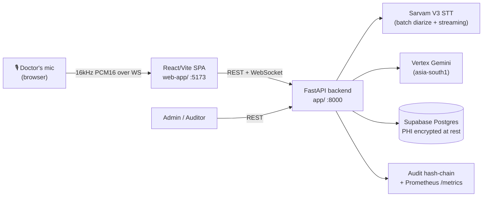
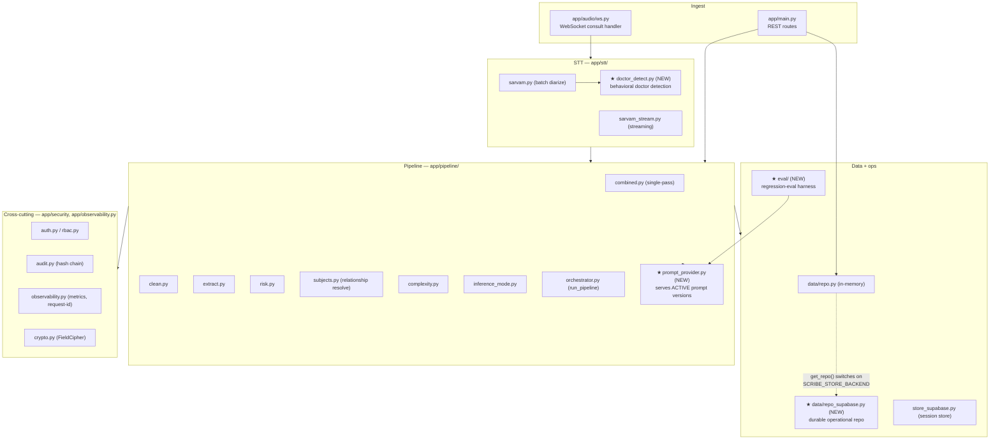
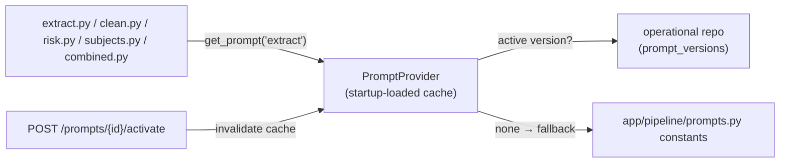
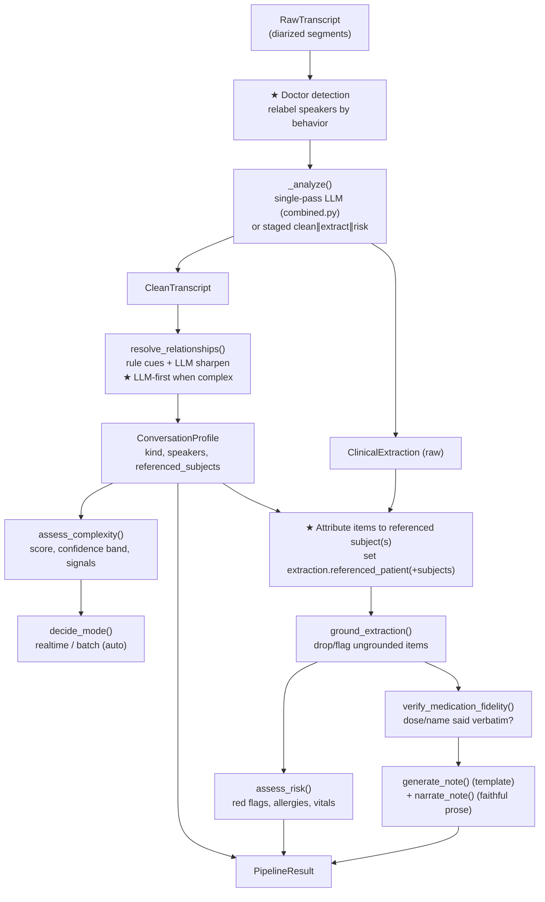
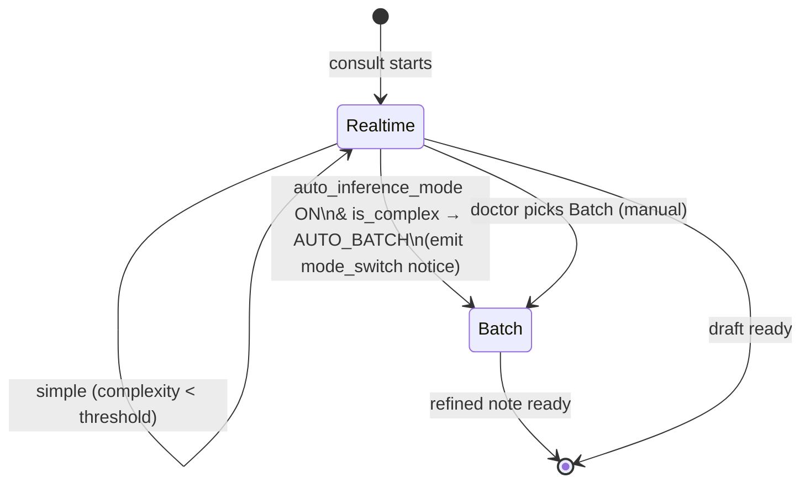

# 1. System & Backend Architecture

Covers deliverables **#1 (system architecture)**, **#2 (backend architecture)**, and
**#9 (AI orchestration workflow)**.

## 1.1 System context



Nothing in the *external* topology changes. The redesign is internal: connect, persist, harden.

## 1.2 Backend module map (current → target)



★ = new modules introduced by the redesign. Everything else exists today.

## 1.3 The four structural changes (architecture level)

### Change A — `PromptProvider` indirection (fixes Gap 1)
Today each stage does `from app.pipeline.prompts import EXTRACT_INSTRUCTION`. We introduce a thin
`PromptProvider` that returns the **active** `PromptVersion.content` for a prompt name, falling back
to the hardcoded constant if no DB version is active.



- Loaded once at startup, cached in-process; `activate_prompt` invalidates the cache.
- The `prompt_version` string already stamped on each session/review now means something:
  it identifies the exact text that produced the note (true rollback + audit).

### Change B — Durable operational repository (fixes Gap 2)
`get_repo()` gains a backend switch identical to the session store's:

```python
# app/data/repo.py (target)
def get_repo() -> Repository:
    if settings.store_backend == "supabase":
        return SupabaseRepository(settings)   # NEW — same method surface
    return InMemoryRepository()               # today's class, renamed
```

`SupabaseRepository` writes through to the existing `supabase/schema.sql` tables, encrypting PHI
columns (`consultation_edits.before_enc/after_enc`, `rendered_documents.*_enc`) with the existing
`FieldCipher` — exactly the pattern in `app/store_supabase.py`. The DB already has the
`enqueue_admin_review` trigger, so "needs_improvement → admin queue" happens in Postgres.

### Change C — Accuracy hardening (fixes Gap 3) — see §1.4 for the orchestration detail
- **Behavioral doctor detection** (`app/stt/doctor_detect.py`): pick the clinician by *behavior*
  (question ratio, clinical vocabulary, imperative phrasing) instead of first-seen order.
- **Multiple referenced patients**: `ConversationProfile.referenced_patient` (scalar) is supplemented
  by `referenced_subjects: list[ReferencedSubject]`, and each `SpeakerProfile.subject_patient` already
  carries per-speaker subject; extraction items gain an optional `subject` tag.
- **LLM-first for complex consults**: when `is_complex`, the LLM relationship pass is authoritative and
  the cue rules become a validation cross-check; for simple consults the cheap rule path stays primary.

### Change D — Real eval harness (fixes Gap 4) — see `06-feedback-and-improvement-pipeline.md`
`app/eval/` runs a candidate prompt over a golden multi-speaker test set and scores attribution /
extraction / risk; results land on `improvement_items.eval_results`. Deployment stays human-gated.

## 1.4 AI orchestration workflow (deliverable #9)

The pipeline (`app/pipeline/orchestrator.py::run_pipeline`) is unchanged in *shape*; the redesign
sharpens the relationship step and sources prompts from the provider.



Key invariants kept from the current code:
- Relationship resolution runs **before** the note is built so symptoms attribute to the referenced
  patient (`orchestrator.py:90-99`).
- Grounding runs **between** extraction and note (`orchestrator.py:101-111`).
- Medication fidelity is non-destructive — it *flags* mismatches, never edits.
- Doctor-edited extractions re-render via `rebuild_from_extraction()` with **no LLM call** and
  ground in *flag* mode (the doctor is the authority).

## 1.5 Real-time vs batch (Goals 3 & 5) — where the decision lives

The streaming WS already runs a **hybrid**: a live draft from streaming STT, then a batch-diarized
*refine* at stop. `inference_mode.decide_mode()` chooses which mode is *authoritative*:



`mode_switch_notice()` already emits the exact Goal-5 banner payload (`est_delay_s: [3,5]`). The
redesign only ensures the **frontend Auto-mode toggle actually sets `auto_inference_mode`** and that
the per-stage latency is recorded to `stage_latencies` so the decision can be tuned with data.

## 1.6 Technology choices (unchanged)

| Concern | Choice | Where |
|---------|--------|-------|
| STT + diarization | Sarvam V3 (`saaras:v3`) | `app/stt/` |
| LLM | Vertex Gemini (`asia-south1`, deterministic temp=0) | `app/llm/vertex_gemini.py` |
| Persistence | Supabase Postgres, PHI in `*_enc` (AES-256-GCM) | `supabase/schema.sql`, `app/store_supabase.py` |
| AI editor (Goal 11) | Gemini, preview-then-apply | `app/main.py:835-899`, `web-app/src/components/AiEditor.tsx` |
| Auth | dev headers now; JWT/Keycloak ready | `app/security/auth.py` |
| Observability | Prometheus + request-id + audit hash-chain | `app/observability.py`, `app/security/audit.py` |

> Note: Gemini is the existing, intended LLM for this product (STT is Sarvam). The redesign keeps
> both; accuracy-critical stages may use the stronger Gemini tier already set in `.env`
> (`gemini-2.5-pro`) without changing providers.
