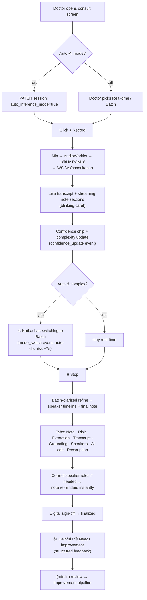

# 2. Frontend Flow & UI Wireframes

Covers deliverables **#3 (frontend flow)** and **#4 (UI wireframes)**.

Stack: React 18 + TypeScript + Vite (`web-app/`), Zustand store (`store.ts`), WebSocket client
(`ws.ts`), custom-CSS design system (`styles.css`, themes: mint/white/dark). The redesign **adds no
new framework** — it binds existing components to live data and fills three real gaps:

- the **Auto-AI-mode toggle** must write `auto_inference_mode` (today the banner reacts but nothing
  arms auto mode from the UI);
- the **admin console** must read *persisted* data (today it reads the in-memory repo);
- the **AI editor** must support **Redo**, not just Undo.

## 2.1 End-to-end consultation flow



## 2.2 Component ↔ goal map (existing, to be wired)

| Component | Goal | Live data source after redesign |
|-----------|------|-------------------------------|
| `Recorder.tsx` + Auto-mode toggle | 3 | `auto_inference_mode` on session |
| `ConfidenceChip.tsx` | 4 | WS `confidence_update` → `profile.summary()` |
| `NoticeBanner.tsx` | 5 | WS `mode_switch` → `mode_switch_notice()` |
| `SpeakerTimeline.tsx` | 1, 6 | `GET /sessions/{id}/profile`; `PATCH .../speakers` |
| `NoteView.tsx` / `ExtractionEditor.tsx` / `RiskPanel.tsx` | — | outputs + edits |
| `AiEditor.tsx` | 11 | `/ai-edit` preview/apply + `/edits` (now persisted, +Redo) |
| `ReviewPrompt.tsx` | 7 | `POST /sessions/{id}/review` (persisted) |
| `AdminDashboard.tsx` | 8, 9, 10, 13 | persisted reviews/improvements/prompts/flags |

## 2.3 Wireframes

### A. Consultation screen — Auto-mode, confidence, notice bar (Goals 3/4/5)

```
┌───────────────────────────────────────────────────────────────────────────┐
│ Svaani · Consultation                         role: doctor ▾    ☀/🌙 theme   │
├───────────────────────────────────────────────────────────────────────────┤
│  ⚠  Multiple speakers detected. Switching to Batch Processing for improved   │ ← NoticeBanner
│     clinical accuracy. Responses may be delayed slightly (≈3–5 s).      [×]  │   (auto-dismiss)
├───────────────────────────────────────────────────────────────────────────┤
│  [● Record]  [■ Stop]        Mode: ( Real-time ) ( Batch )                   │
│  ┌───────────────────────────────┐   [✓] Auto AI Mode                       │ ← arms auto_inference_mode
│  │  ░░▁▂▄▆█▆▄▂▁░░  waveform       │   AI picks real-time/batch by complexity  │
│  └───────────────────────────────┘                                          │
│                                                                              │
│  Conversation Quality:  🟡 Moderate (84%)                                    │ ← ConfidenceChip
│     • multiple speakers   • relationship ambiguity                           │   (reasons)
└───────────────────────────────────────────────────────────────────────────┘
```

### B. Speaker timeline with correction (Goals 1 & 6)

```
┌─ Speakers ──────────────────────────────────────────────────────────────────┐
│ Conversation: Doctor + Parent      Referenced patient: SON                    │
│                                                                               │
│  Speaker      Role          Relationship     Subject    Conf.   Correct       │
│  ─────────    ───────────   ─────────────    ───────    ─────   ───────       │
│  speaker_0    Doctor   ▾    clinician        —          0.97                  │
│  speaker_1    Caregiver▾    parent       ▾   son        0.88    [save]        │ ← editable
│  speaker_2    Patient   ▾   self         ▾   patient    0.61 ⚠  [save]        │ ← low conf flagged
│                                                                               │
│  ⓘ Changing a role or referenced patient re-renders the note immediately.     │
└───────────────────────────────────────────────────────────────────────────┘
```

> **Multi-patient addition:** when `referenced_subjects` has >1 entry the header shows
> `Referenced patients: SON, FATHER` and each extraction item displays its `subject` tag so the
> doctor sees *whose* complaint each line is.

### C. AI consultation editor with preview + undo/redo (Goal 11)

```
┌─ AI Assistant (edit) ─────────────────────────────────────────────────────────┐
│ Instruction:  "Move diabetes into past medical history."            [ Preview ] │
│                                                                                 │
│  Proposed change (diff):                                                        │
│   Assessment:                                                                   │
│   - … type 2 diabetes …                          (removed)                      │
│   Past Medical History:                                                         │
│   + Type 2 diabetes mellitus                     (added)                        │
│                                                                                 │
│  ⓘ AI reorganises/rephrases only — it cannot add new clinical facts.            │
│                                       [ ↶ Undo ] [ ↷ Redo ]  [ Discard ] [Apply]│ ← Redo NEW
└─────────────────────────────────────────────────────────────────────────────┘
```

### D. End-of-consult review prompt (Goal 7)

```
┌─ How was this note? ─────────────────────────────────────────────────────────┐
│                         (  👍 Helpful  )   (  👎 Needs improvement  )           │
│                                                                                │
│  If "Needs improvement", what went wrong? (select all)                         │
│   ☐ Wrong patient identified     ☐ Wrong speaker assignment                    │
│   ☐ Incorrect SOAP summary       ☐ Medication extraction error                 │
│   ☐ Timeline error               ☐ Prompt misunderstanding                     │
│   ☐ Missing diagnosis            ☐ Hallucination          ☐ Other              │
│                                                                                │
│  Comment (optional): [______________________________________________]         │
│                                                                  [ Submit ]    │
└────────────────────────────────────────────────────────────────────────────┘
```

### E. Admin console (Goals 8/9/10/13) — see `07-admin-dashboard.md` for detail

```
┌─ Admin ───────────────────────────────────────────────────────────────────────┐
│ [ Reviews ] [ Improvements ] [ Prompts ] [ Models ] [ Flags ] [ Analytics ]     │
├─────────────────────────────────────────────────────────────────────────────┤
│ Reviews    Filter: category [wrong_patient ▾]  status [pending ▾]  🔍 search    │
│  Consult     When     Model        Prompt   Category          Conf  Spk  Mode   │
│  cs-4f2…     10:02    gemini-2.5   relat:v3 wrong_patient     0.71   3   auto_b  │
│              "scribe attributed mother's history to the son"   [Approve][Reject] │
└─────────────────────────────────────────────────────────────────────────────┘
```

## 2.4 Frontend state & realtime mechanics (unchanged transport)

WebSocket message types already handled in `ws.ts` / `App.tsx`: `stage_update`, `final_segment`,
`note_chunk`, `risk_warning`, `analysis`, `draft_ready`, `refined`, `confidence_update`,
`mode_switch`, `error`. The redesign adds **no new transport** — only ensures `confidence_update`
and `mode_switch` fire from the live `ConversationProfile` and that the Auto-mode toggle sends its
state on `start`.

Responsiveness rules (Goal 12) the frontend must honor:
- Live note streams section-by-section with a caret; never block the UI waiting for refine.
- The notice bar is non-modal and auto-dismisses (~7 s) — it informs, never interrupts.
- Speaker corrections call `PATCH .../speakers` and patch the note in place (no full reload).
