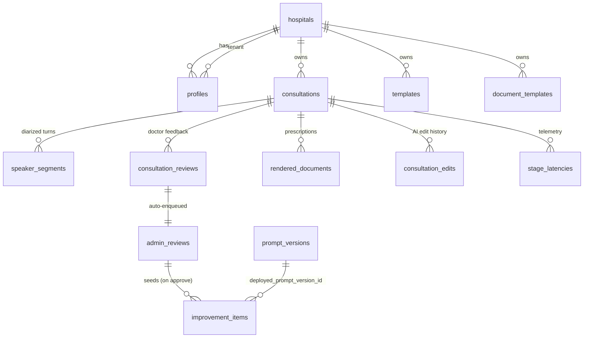

# 3. Database Schema (Data Model)

Covers deliverable **#5**. The existing `supabase/schema.sql` is already comprehensive and aligned
to all 13 goals. This section (a) documents the current model, and (b) specifies the **small,
additive** changes the redesign needs — primarily multi-patient support, A/B metrics, and an
eval-run record. **No destructive migrations.**

## 3.1 Current entity map (existing — keep)



Key properties already in place:
- **PHI encrypted at rest:** `consultations.session_enc/result_enc`, `speaker_segments.text_enc`,
  `rendered_documents.*_enc`, `consultation_edits.before_enc/after_enc` are AES-256-GCM blobs.
  Plain columns hold only non-PHI signals (`complexity_score`, `inference_mode`, `confidence_band`,
  `model_version`, `prompt_version`, `error_categories`, statuses, timings).
- **Multi-tenant RLS** by `hospital_id`; `service_role` (server) bypasses; admins/auditors get
  hospital-wide read on review/audit tables.
- **Append-only audit** (`audit_events`) with a SHA-256 hash chain; UPDATE/DELETE revoked by rule.
- **Triggers:** `enqueue_admin_review` auto-creates an `admin_reviews` row for every
  `needs_improvement` review; `set_updated_at` maintains timestamps.
- **`prompt_versions.content_hash`** is a generated SHA-256 column — perfect for dedupe/rollback.
- Note: `consultations` already has `auto_mode boolean` and `referenced_patient text`.

## 3.2 Additive changes (the redesign)

### 3.2.1 Multiple referenced patients (Goal 1 hardening)
`referenced_patient text` on `consultations` stays (back-compat: the primary subject). Add a JSONB
column for the full set, and tag each speaker segment's subject (already present as
`speaker_segments.subject_patient`).

```sql
-- consultations: capture every distinct person the consult is about (multi-family)
alter table consultations
  add column if not exists referenced_subjects jsonb not null default '[]'::jsonb;
-- shape: [{"label":"son","relationship":"parent","evidence_span_ids":["seg-3","seg-7"]},
--         {"label":"father","relationship":"child","evidence_span_ids":["seg-12"]}]
```
The application `ConversationProfile` gains a matching `referenced_subjects: list[ReferencedSubject]`
(see `01-system-architecture.md` §1.3). Extraction items optionally carry a `subject` label so the
note/timeline can show *whose* complaint each line is.

### 3.2.2 Prompt A/B testing metrics (Goals 9 & 13)
Versioning + active-flag exist. A/B needs (a) a way to *route* a fraction of traffic to a candidate
version and (b) a place to aggregate outcome metrics. Routing rides the existing `feature_flags`
table (`value` carries the split, e.g. `{"prompt":"relationship","b_version_id":"…","b_pct":20}`).
Metrics get a dedicated table:

```sql
create table if not exists prompt_ab_metrics (
  id              uuid primary key default gen_random_uuid(),
  prompt_name     text not null,
  version_id      uuid references prompt_versions(id) on delete cascade,
  arm             text not null,            -- 'a' (active) | 'b' (candidate)
  consultation_id uuid references consultations(id) on delete set null,
  -- outcome signals (non-PHI): downstream review verdict + latency
  helpful         boolean,                  -- from consultation_reviews
  error_categories error_category[] default '{}',
  latency_ms      int,
  created_at      timestamptz not null default now()
);
create index if not exists idx_abmetrics_name_arm on prompt_ab_metrics(prompt_name, arm);
```

### 3.2.3 Eval-run record (Goal 9 engine)
`improvement_items.eval_results jsonb` and `regression_test_id text` already exist. To make
eval-runs first-class and queryable (so the admin can see *which* golden set, *what* scores), add:

```sql
create table if not exists eval_runs (
  id                 uuid primary key default gen_random_uuid(),
  improvement_item_id uuid references improvement_items(id) on delete cascade,
  prompt_name        text not null,
  candidate_version_id uuid references prompt_versions(id) on delete set null,
  dataset            text not null,         -- e.g. 'golden/multispeaker@v1'
  n_cases            int not null,
  scores             jsonb not null default '{}'::jsonb,  -- {attribution:0.96, extraction:0.91, risk:0.88}
  passed             boolean not null default false,
  created_by         uuid references auth.users(id),
  created_at         timestamptz not null default now()
);
create index if not exists idx_evalruns_item on eval_runs(improvement_item_id);
```

### 3.2.4 RLS for the new tables
Mirror the existing admin policies: `prompt_ab_metrics` and `eval_runs` are admin/auditor-readable,
admin-writable; `prompt_ab_metrics` inserts are allowed for tenant members (server writes them).

## 3.3 Operational repository ↔ schema mapping (Gap 2 fix)

`SupabaseRepository` (new) maps the in-memory `Repository` method surface to these tables:

| Repository method (`app/data/repo.py`) | Table(s) |
|------------------------------------------|----------|
| `add_review` / `list_reviews` | `consultation_reviews` (trigger fills `admin_reviews`) |
| `list_admin_reviews` / `update_admin_review` | `admin_reviews` (+ join `consultation_reviews`) |
| `_seed_improvement` / `list_improvements` / `advance_improvement` | `improvement_items` (+ `eval_runs`) |
| `add_prompt_version` / `activate_prompt` / `list_prompts` / `active_prompt` | `prompt_versions` |
| `add_model_version` / `list_models` | `model_versions` |
| `add_document_template` / `get/list_document_templates` | `document_templates` |
| `save/get/list_rendered_document` | `rendered_documents` (PHI → `*_enc`) |
| `add_edit` / `list_edits` | `consultation_edits` (PHI → `before_enc/after_enc`, +`undone` for redo) |
| `set_flag` / `list_flags` | `feature_flags` |

The `consultations` / `speaker_segments` / `stage_latencies` rows are written by the **session
store** (`app/store_supabase.py`) and pipeline, not the operational repo — keeping the two
responsibilities cleanly separated (session/clinical vs operational/quality).

## 3.4 Migration & seeding plan

1. Ship the additive `alter table` / `create table` statements as a new file
   `supabase/migrations/2026xx_redesign.sql` (idempotent `if not exists`).
2. Seed v1 `prompt_versions` from the current constants (the in-memory repo already does this in
   `_seed`; `SupabaseRepository` will upsert the same on first boot if the table is empty).
3. Seed `model_versions` from `settings.gemini_model`.
4. No data migration is needed for existing rows: `referenced_subjects` defaults to `[]`,
   `consultation_edits.undone` defaults `false`.
