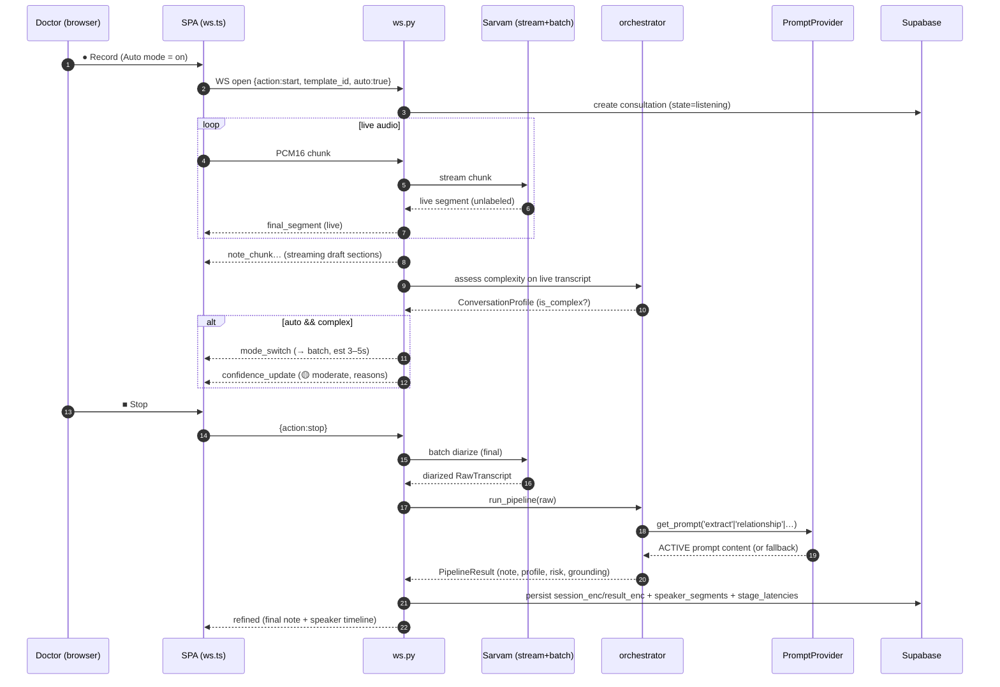
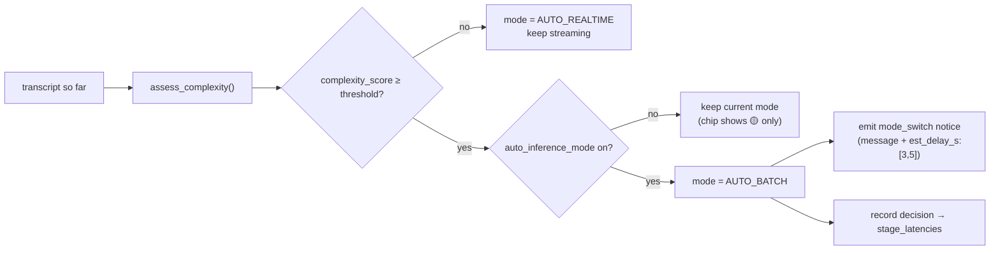
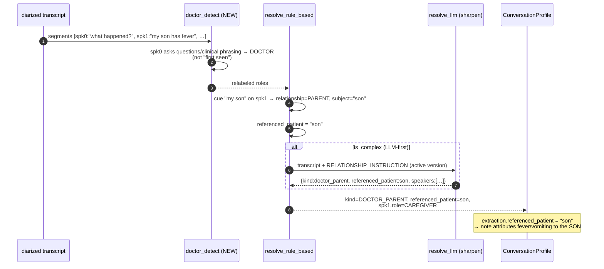
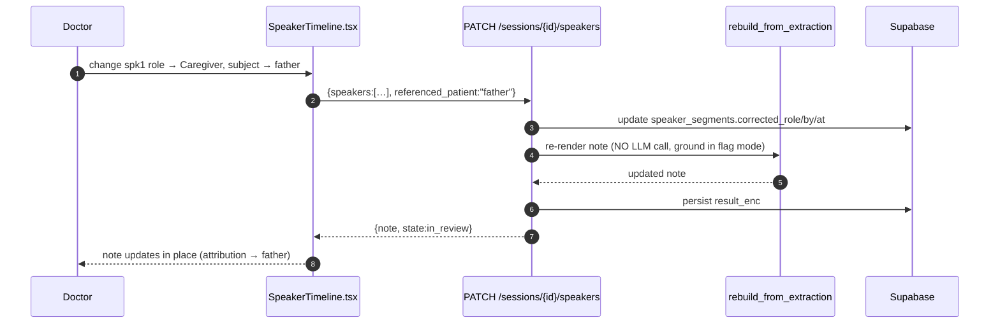
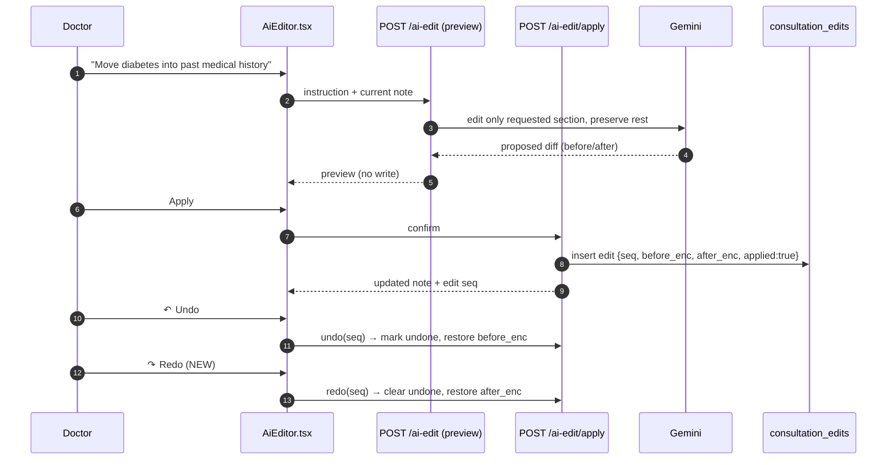
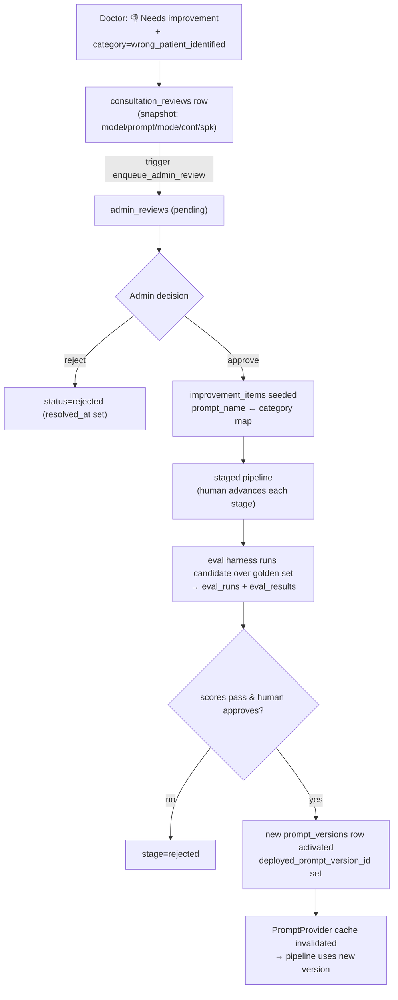
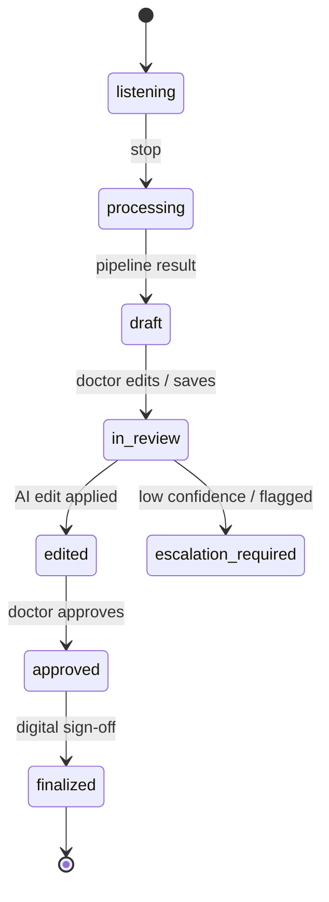

# 4. Event Flow & Sequence Diagrams

Covers deliverables **#6 (event flow)** and **#8 (sequence diagrams)**.

## 4.1 Real-time consultation (hybrid stream → refine)

## 4.2 Auto-mode escalation (Goal 3 & 5) — the decision detail

Complexity signals (from `app/pipeline/complexity.py`, weights shown):
`extra_speakers .30`, `relationship_ambiguity .20`, `multiple_subjects .20`, `cross_talk .15`,
`pronoun_ambiguity .10`, `poor_audio .20`; score capped at 1.0, complex if `≥ complexity_threshold`.

## 4.3 Relationship resolution — the Mother/Son case (Goal 1)

## 4.4 Speaker correction → instant re-render (Goal 6)

## 4.5 AI edit with preview / apply / undo / redo (Goal 11)

## 4.6 Feedback → admin → improvement (Goals 7→8→9) — event flow

`_CATEGORY_TO_PROMPT` (in `app/data/repo.py`) seeds which prompt an error implicates:
`wrong_patient_identified`/`wrong_speaker_assignment` → **relationship**; `incorrect_soap_summary`/
`medication_extraction_error`/`timeline_error`/`missing_diagnosis`/`hallucination` → **extract**;
`prompt_misunderstanding`/`other` → **combined**.

## 4.7 Note finalization & sign-off (state machine)

Export (JSON/FHIR/Markdown/PDF) is allowed only after `finalized` — already enforced in the
sign-off flow.
