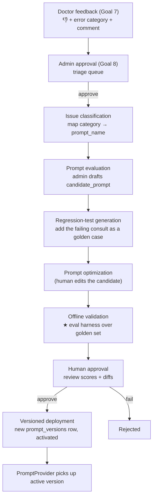
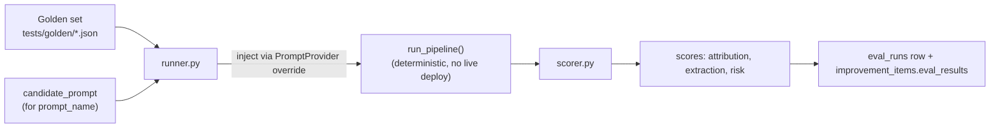
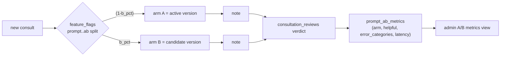

# 6. Feedback Learning & Continuous Improvement Pipeline

Covers deliverable **#10**. Decision (with user): **human-gated** pipeline with a **real offline
regression-eval harness**. Prompts are **never** modified automatically in production. A/B is
flag-routed prompt versions with outcome metrics.

## 6.1 The loop, end to end



This is exactly `IMPROVEMENT_ORDER` in `app/schemas/review.py`:
`issue_classification → prompt_evaluation → regression_test_generation → prompt_optimization →
offline_validation → human_approval → deployed`. Today `advance_improvement()` just increments the
index; the redesign **puts an engine behind two of those stages** (regression-test-generation and
offline-validation) and a **real deployment** behind the last.

## 6.2 The regression-eval harness (`app/eval/`, NEW)



### Golden case format
Each case is a scripted, diarized transcript + the expected attribution/extraction (no audio
needed — drives the same path as `POST /sessions/{sid}/simulate`).

```json
{
  "id": "mother-son-fever",
  "transcript": [
    {"speaker":"speaker_0","text":"What happened?"},
    {"speaker":"speaker_1","text":"Doctor, my son has had fever for three days."},
    {"speaker":"speaker_0","text":"Is he vomiting?"},
    {"speaker":"speaker_1","text":"Yes, twice."}
  ],
  "expect": {
    "referenced_patient": "son",
    "kind": "doctor_parent",
    "speakers": {"speaker_0":"doctor", "speaker_1":"caregiver"},
    "symptoms_subject": "son"
  }
}
```

Initial golden set (the hardening targets):
- `mother-son-fever` — the canonical case (caregiver speaks, child is patient).
- `speaking-for-father` — "I am speaking for my father" → patient = father.
- `translator` — interpreter relays a patient's words; the *patient* is a third speaker.
- `multi-family` — two relatives describe two different patients (multi-`referenced_subjects`).
- `cross-talk` — overlapping turns / interruptions; complexity must flag it.
- `self-report` — single patient describing own symptoms (must NOT invent a caregiver).
- `patient-speaks-first` — patient speaks before the doctor (doctor-detection must not mislabel).

### Scorer metrics
| Metric | Definition |
|--------|------------|
| **attribution** | fraction of cases where `referenced_patient`/`referenced_subjects` and per-speaker roles match `expect` |
| **extraction** | grounded-item F1 against expected entities (chief complaints, meds, vitals) |
| **risk** | red-flag precision/recall (no false flags on denied/negated symptoms) |
| **regressions** | count of previously-passing cases the candidate breaks (gate: must be 0) |

A candidate **passes** when attribution ≥ active baseline AND regressions == 0 AND no metric drops
beyond a configurable tolerance. Results are written to `eval_runs.scores` and surfaced in the admin
console (`07-admin-dashboard.md`).

## 6.3 How the harness stays offline & safe

- It runs `run_pipeline` with a **PromptProvider override** that injects the candidate text for one
  prompt name only — it never writes a `prompt_versions` row and never flips `active`.
- It uses the same deterministic settings as production (`temp=0`), so scores are reproducible.
- Deployment is a **separate, explicit** admin action (`activate_prompt`) gated behind
  `improvement_stage = human_approval` with a passing `eval_run`.

## 6.4 A/B testing (Goal 13)

For changes where offline metrics are inconclusive, route a fraction of live traffic to a candidate
version and compare **downstream** outcomes (review verdicts + latency), never altering the note for
the doctor's experience beyond the prompt under test.



Guardrails: A/B is admin-armed, hospital-scoped via the flag's `hospital_id`, and auto-halts (flag
disabled) if arm B's `needs_improvement` rate exceeds arm A by a configured margin.

## 6.5 Governance summary

- **Versioned:** every prompt change is a new immutable `prompt_versions` row (`content_hash` dedupes).
- **Tested:** no deploy without a passing `eval_run` referencing a named golden dataset.
- **Approved:** `human_approval` stage requires a named approver (`improvement_items.approved_by`).
- **Auditable:** activation writes an `audit_events` row; `prompt_version` is stamped on every note,
  so any output can be traced to the exact prompt + model that produced it (true rollback).
