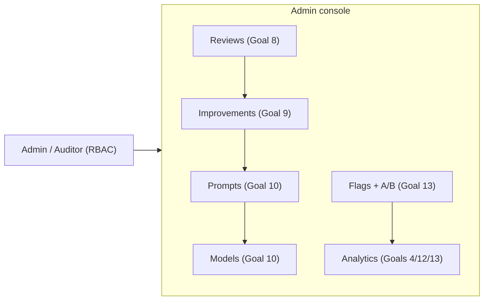

# 7. Admin Dashboard Design

Covers deliverable **#11**. The `AdminDashboard.tsx` component already exists with Reviews,
Improvements, Prompts, and Flags tabs. The redesign (a) makes every tab read **persisted** data,
(b) adds **Models** and **Analytics** tabs, and (c) wires the **eval/A-B** actions.

## 7.1 Information architecture



Access: `admin` can mutate; `auditor` is read-only (matches the RLS policies in `supabase/schema.sql`
— `current_app_role() in ('admin','auditor')` for read, `= 'admin'` for write).

## 7.2 Reviews tab (Goal 8)

Each row carries the full context snapshot stored on `consultation_reviews` so triage needs no
re-derivation. Filter & search by error category and status (the schema has a GIN index on
`error_categories`).

```
┌─ Reviews ──────────────────────────────────────────────────────────────────────┐
│ Filter: category [ wrong_patient_identified ▾ ]  status [ pending ▾ ]   🔍 ____  │
├──────────────────────────────────────────────────────────────────────────────┤
│ Consult   When    Model         Prompt        Category            Conf Spk Mode  │
│ cs-4f2…   10:02   gemini-2.5pro  relat:v3      wrong_patient       .71  3  auto_b │
│   💬 "attributed the mother's history to the son"                                │
│   [ Approve → seed improvement ]  [ Reject ]  [ Assign ▾ ]  [ Resolve ]          │
├──────────────────────────────────────────────────────────────────────────────┤
│ cs-9aa…   09:48   gemini-2.5pro  extract:v2    medication_error    .93  2  rt     │
└──────────────────────────────────────────────────────────────────────────────┘
```

Fields shown (all from the schema): Consultation ID, Timestamp, Model Version, Prompt Version,
Error Category, Doctor Comment, Audio Confidence, Speaker Count, Inference Mode, Admin Status.

## 7.3 Improvements tab (Goal 9)

Shows each `improvement_items` row with its stage as a progress rail; the **Validate** action runs
the eval harness, and **Deploy** is enabled only after a passing `eval_run` + human approval.

```
┌─ Improvements ───────────────────────────────────────────────────────────────────┐
│ imp-77c…  prompt: relationship   from: wrong_patient_identified                    │
│ ● issue_class ─ ● prompt_eval ─ ● regr_test ─ �an_optimization ─ ○ validation ─ ○ approve ─ ○ deployed │
│                                                                                    │
│ Candidate prompt:  [ textarea … ]                                                  │
│ Golden set: golden/multispeaker@v1   [ ▶ Run eval ]                                │
│ Last eval:  attribution 0.96 ↑  extraction 0.91  risk 0.88  regressions 0  ✅ pass │
│                                          [ Reject ]  [ Approve & Deploy (admin) ]   │
└──────────────────────────────────────────────────────────────────────────────┘
```

## 7.4 Prompts & Models tabs (Goal 10)

```
┌─ Prompts ─────────────────────────────────────────────────────────────────────┐
│ name           ver  active  hash       created        actions                   │
│ relationship   3    ●       a1b2c3…    2026-06-15      [ View ] [ Diff v2 ]      │
│ relationship   2            d4e5f6…    2026-05-30      [ Activate ] ← changes    │
│ extract        2    ●       7788aa…    2026-06-01        the LIVE pipeline       │
│                                                            [ + New version ]     │
└───────────────────────────────────────────────────────────────────────────────┘
```

**Critical behavior change:** clicking **Activate** now invalidates the `PromptProvider` cache so the
running pipeline immediately uses the activated text (closes Gap 1). The Models tab lists
`model_versions` (provider, model_id, active) for audit/rollback.

## 7.5 Flags + A/B tab (Goal 13)

```
┌─ Feature flags & A/B ─────────────────────────────────────────────────────────┐
│ key                         scope     enabled  value                            │
│ auto_inference_default      global    ☐                                          │
│ ai_edit_enabled             global    ☑                                          │
│ prompt.relationship.ab      demo-hosp ☑        { b_version: v4, b_pct: 20 }      │
│   A/B metrics → arm A needs_improve 6%  |  arm B 3%   (n=210/52)   [ Promote B ] │
└───────────────────────────────────────────────────────────────────────────────┘
```

## 7.6 Analytics tab (Goals 4, 12, 13)

Error analytics + latency, both queryable because the metadata is plain (non-PHI) in Postgres.

```
┌─ Analytics ────────────────────────────────────────────────────────────────────┐
│ Errors by category (last 30d)                 Stage latency p50/p95 (ms)          │
│  wrong_patient_identified  ████████ 41         stt     820 / 1900                 │
│  medication_extraction     ████ 19             clean   150 /  410                 │
│  incorrect_soap_summary    ███ 14              extract 640 / 1500                 │
│  hallucination             █ 4                 note     90 /  220                 │
│  …                                             diarize 1100 / 2600 (batch)        │
│                                                                                   │
│ Confidence band mix:  🟢 62%   🟡 29%   🔴 9%      Auto→Batch switches: 84        │
└──────────────────────────────────────────────────────────────────────────────┘
```

Sources: error counts from `consultation_reviews.error_categories`; latency percentiles from
`stage_latencies`; confidence-band mix from `consultations.confidence_band`; A/B from
`prompt_ab_metrics`. These power the `/admin/analytics/*` endpoints (`05-api-design.md` §5.3).

## 7.7 Admin actions → audit

Every admin mutation (approve/reject, activate prompt, set flag, promote A/B, deploy) writes an
`audit_events` row (actor, action, resource, hash-chained). The audit tab (auditor-visible) renders
this immutable trail.
