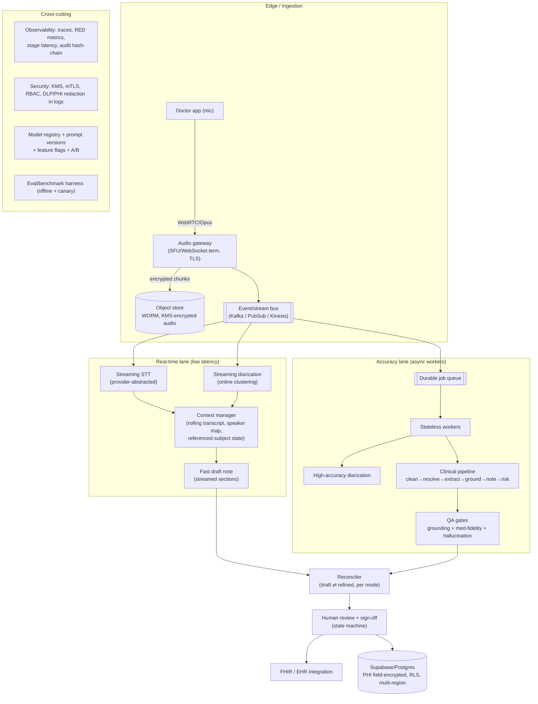

# 9. Enterprise Architecture Review & State-of-the-Art Design (2026)

> **Tuned to the real Svaani codebase**, not a generic template. Where the prompt assumed
> Google Chirp 3 + HIPAA, this project actually runs **Sarvam V3 STT + Vertex Gemini in
> `asia-south1`**, persists to **Supabase Postgres (PHI field-encrypted)**, and targets **India
> residency (DPDPA/ABDM)** with HIPAA as a secondary posture. Review panel perspective:
> Principal AI Architect, Distributed Systems, Real-Time Speech, Cloud Cost, MLOps, Healthcare
> AI, Benchmarking, Security & Compliance.

> **Honesty disclaimer (read before §3/§5):** vendor specs (WER, latency, $/hr) and cost models
> below are **representative early-2026 public ranges**, not measured truth. They are decision
> *starting points*. The benchmarking harness in §4 (built on the existing [app/eval/](../../app/eval/))
> is how you replace these estimates with numbers you can defend.

---

## 9.1 Architecture Review — challenging what exists today

### What the code actually does (ground truth)
- **Ingestion:** browser mic → 16 kHz PCM16 over a single WebSocket ([app/audio/ws.py](../../app/audio/ws.py)).
- **STT:** Sarvam V3 — *streaming* (no diarization) for live words + *batch job* (`speech_to_text_job`,
  polled, with a documented eventual-consistency retry hack in [app/stt/sarvam.py](../../app/stt/sarvam.py))
  for speaker-labeled accuracy. The 4 modes (realtime/hybrid/batch/auto) choose which passes run.
- **Reasoning:** single-pass Gemini call (clean+extract+risk) via [app/pipeline/combined.py](../../app/pipeline/combined.py),
  then deterministic note render + faithful narration. Grounding + medication-fidelity gates.
- **Persistence:** Supabase Postgres, PHI in `*_enc` AES-256-GCM columns, RLS by `hospital_id`.
- **Runtime:** one FastAPI process; pipeline runs via `asyncio.to_thread`; **the full consult's PCM
  is buffered in memory** in the WS handler (`bytearray`).

### Bottlenecks
| # | Bottleneck | Evidence | Why it bites at scale |
|---|-----------|----------|----------------------|
| B1 | **Batch diarization is the long pole** | Sarvam `speech_to_text_job` is create→upload→poll→download, with retries for eventual consistency | Dominates tail latency; every Hybrid/Batch/Auto-complex consult waits on it |
| B2 | **In-memory PCM buffer per consult** | `buffer = bytearray()` accumulates the whole recording | A 30-min consult ≈ 57 MB/stream in RAM × concurrency → OOM risk; lost on crash |
| B3 | **Stateful WebSocket** | live session + buffer live in one process | Forces **sticky sessions**; no horizontal rebalancing mid-consult |
| B4 | **Synchronous pipeline in the request lifecycle** | `_finalize`/`_process` run the pipeline inline | A pod restart mid-processing **loses the consult** — no durable job |
| B5 | **Supabase small-instance connection cap** | pooler + `supabase_pool_max` | Connection exhaustion is the first wall under load |

### Single points of failure
- **Sarvam** (only STT) — outage = no transcripts. **Vertex Gemini** (only LLM) — outage = no notes
  (deterministic fallback exists, but it's bare). **Single region `asia-south1`** — regional outage =
  full outage. **One FastAPI deployment** — no queue to absorb a crash; in-flight consults vanish.

### Cost inefficiencies
- **Hybrid/Auto pay STT twice** (streaming *and* batch) — the accuracy/latency win is real, but it's
  ~2× STT $/hr on those consults.
- **LLM on every consult** with no **semantic/exact-match caching** of repeated structures.
- **`temp=0` single-pass** is already cost-smart; the waste is STT duplication + no model routing
  (a flash-tier model would suffice for simple consults; pro-tier reserved for complex).

### Latency issues
- Time-to-final-note is gated by B1 (diarization). Real-time mode sidesteps it but loses speaker
  attribution. There is **no streaming diarization** — the core latency/accuracy tension.

### Scalability risks
- Stateful WS + in-memory buffer (B2/B3) cap per-pod concurrency and block clean autoscaling.
- No worker/queue tier (B4): bursty load can't be smoothed; long jobs hold a connection.

### Vendor lock-in
- **Sarvam** (India-specific, strong on Indic + code-switching, but a smaller vendor → concentration
  risk) and **Vertex** (GCP) are both single-sourced. The LLM layer is already abstracted
  ([app/llm/base.py](../../app/llm/base.py)); the **STT layer is not** behind a clean provider
  interface beyond `get_stt` — that's the lock-in to break first.

### Credit where due (don't rebuild these)
The QA layer (grounding + medication fidelity), human-review state machine + digital sign-off, FHIR
export, append-only hash-chained audit, prompt/model versioning, and the **offline eval harness** are
already production-shaped. The redesign **builds on** them.

---

## 9.2 State-of-the-Art Architecture (2026 target)

**Key moves vs. today:**
1. **Decouple ingestion from processing** via an event bus + **durable job queue** (fixes B3/B4):
   API/WS pods become stateless; a crash re-queues, never loses a consult.
2. **Audio to encrypted object storage** (fixes B2): stream chunks straight to a KMS-encrypted WORM
   bucket; workers read from there, not from a pod's RAM.
3. **Add streaming diarization** (the real SOTA unlock): online speaker clustering on the live lane so
   Real-time/Hybrid get *approximate* speaker labels instantly, then the batch lane sharpens them.
   This is what makes the "mid-consult Auto switch" (the deferred §2b) actually possible.
4. **Provider-abstracted STT** behind one interface (mirror [app/llm/base.py](../../app/llm/base.py))
   so Sarvam/Chirp/Deepgram are swappable + can run **shadow/canary** for benchmarking.
5. **Model routing**: flash-tier LLM for simple consults, pro-tier for complex (the complexity score
   already exists — reuse it to route, not just to pick batch/realtime).
6. **Reconciler** owns the draft⇄refined merge per mode (the logic now in `_finalize`), but as a
   durable, restartable step.

Layer-by-layer (audio ingestion, streaming, diarization, STT, context, clinical reasoning, note gen,
QA, human review, storage, observability, security, compliance) maps 1:1 onto the diagram; the
clinical-reasoning, QA, human-review, storage, and audit layers **already exist** and are reused.

---

## 9.3 Technology Selection — STT shoot-out (estimates; validate via §4)

Residency is the **first filter** for this project (India DPDPA/ABDM), then accuracy/latency/cost.

| Provider | WER (clean/med) approx | Medical | Diarization | Stream latency | Cost/hr approx | India residency | Maturity |
|---|---|---|---|---|---|---|---|
| **Sarvam V3** (current) | ~8–14% / good Indic+code-switch | medium | batch good, **no streaming diar** | ~sub-sec stream | ~$0.3–0.6 | ✅ India-native | growing |
| **Google Chirp 3** (stream) | ~6–10% | medium | streaming diar (improving) | low | ~$0.4–1.0 | ✅ `asia-south1` | high (GCP) |
| **Deepgram Nova-3 (Medical)** | ~5–9% / strong medical | **high** | strong streaming diar | **very low** | ~$0.4–0.9 | ⚠️ US SaaS (BAA; region?) | high |
| **AssemblyAI** | ~6–10% | medium-high | good | low-med | ~$0.4–0.9 | ⚠️ US SaaS | high |
| **AWS Transcribe Medical** | ~6–10% / medical-tuned | **high** | good | medium | ~$0.75–1.5 | ⚠️ limited India regions | high |
| **Azure Speech (+ healthcare)** | ~6–10% | high | good | low-med | ~$0.5–1.1 | ✅ India regions | high |
| **OpenAI Realtime (gpt-4o-audio)** | ~6–9% (ASR varies) | medium | weak/none native diar | **very low** | $$ (token-priced) | ⚠️ US SaaS | medium-new |

**Panel read:** for India-residency + Indic/code-switching, **Sarvam stays the default** but is
**concentration risk**; **Chirp 3 in `asia-south1`** is the strongest residency-compliant alternative
with real **streaming diarization** (directly fixes the no-streaming-diar gap). **Deepgram/Azure**
are the medical-accuracy leaders but need a residency/BAA story before PHI. Recommendation: **dual-source
behind the provider interface — Sarvam + Chirp 3** — and let §4 pick the default per-locale with data.

---

## 9.4 Benchmarking Framework (extend [app/eval/](../../app/eval/))

The harness already scores **attribution** on a golden set. Extend it to a multi-axis, multi-provider
scorecard. Methodology: a labeled golden corpus (real-de-identified + synthetic multi-speaker), run
each (provider × mode) through the same pipeline, score offline + shadow-canary in prod.

| Metric | Formula / method |
|---|---|
| **STT WER** | `(S+D+I)/N` (substitutions+deletions+insertions over reference words) |
| **Medical-term accuracy** | term-level F1 on a medical lexicon (drugs/doses/findings); weight dose/drug errors heavier |
| **Diarization** | **DER** = `(false-alarm + missed + speaker-error)/total time`; plus **JER** |
| **Attribution** (clinical) | already in [scorer.py](../../app/eval/scorer.py): correct referenced-patient + roles |
| **Latency** | time-to-first-token (draft) and time-to-final-note; report **p50/p95/p99** |
| **Throughput** | concurrent consults/pod at SLO; audio-seconds processed/sec |
| **Cost** | `$/consult = STT_$/hr·dur + LLM_$·tokens + infra_amortized` |
| **Reliability** | success rate, **SLO error budget**, mean-time-to-recover |

Gate: a provider/prompt change **deploys only** if WER↓ or flat, DER↓ or flat, attribution ≥ baseline,
**zero regressions** on the golden set, and p95 latency within budget — enforced by the existing
human-gated improvement pipeline ([06-feedback-and-improvement-pipeline.md](06-feedback-and-improvement-pipeline.md)).

---

## 9.5 Cost Optimization — three architectures

Assumptions (state them, then measure): avg consult **15 min**; LLM ~**4k in / 2k out tokens**; STT
priced per audio-hour; infra amortized. Hybrid/Auto-complex incur **2× STT** (stream + batch).

| Tier | STT | LLM | Diar | Notes |
|---|---|---|---|---|
| **Lowest cost** | Sarvam stream only (Real-time mode default) | flash-tier, single-pass | none (no batch) | cheapest; weaker multi-speaker |
| **Balanced** | Sarvam stream + batch **only when complex** (Auto) | flash, pro only if complex | conditional | best $/accuracy |
| **Premium** | Chirp 3 streaming-diar + Sarvam batch verify | pro-tier | streaming + batch | Hybrid default; highest accuracy |

**Rough monthly estimates** (illustrative — validate):

| Volume | Lowest | Balanced | Premium |
|---|---|---|---|
| 100 hrs | ~$40–80 | ~$70–140 | ~$150–300 |
| 1,000 hrs | ~$0.4–0.8k | ~$0.7–1.4k | ~$1.5–3k |
| 10,000 hrs | ~$4–8k | ~$7–14k | ~$15–30k |
| 100,000 hrs | ~$40–80k | ~$70–140k | ~$150–300k |

Biggest levers, in order: (1) **don't double-STT** unless needed (Auto/complexity routing), (2) **LLM
model routing** by complexity, (3) **caching** repeated structures, (4) **reserved/committed-use**
discounts at the 10k+ tier, (5) **batch off-peak** for non-urgent refines.

---

## 9.6 Future-proofing

- **AI agents / autonomous documentation:** the human-gated improvement pipeline + eval harness is the
  safety substrate; agents propose, evals + humans approve. Never auto-write to the EHR without sign-off.
- **Ambient intelligence:** the streaming lane + context manager generalize to always-on room capture;
  privacy/consent + on-device VAD gating become first-class.
- **Real-time clinical copilot:** the complexity/confidence signals + grounded extraction feed live
  suggestions (drug-interaction, missing-history prompts) — strictly *attention aids*, never decisions.
- **Multi-modal:** the same context manager ingests vitals devices, images (derm/wound), and labs;
  provenance/grounding extends to non-text evidence.
- **Migration enabler:** because reasoning is provider-abstracted and prompt/model-versioned, swapping
  to next-gen models is a registry change + an eval gate, not a rewrite.

---

## 9.7 Final Recommendation

- **Architecture:** decoupled ingestion → object-store audio → event bus → **stateless API + durable
  job queue + workers**; **dual STT (Sarvam + Chirp 3) behind a provider interface** with **streaming
  diarization**; complexity-routed LLM (flash/pro); reconciler for draft⇄refined; reuse the existing
  QA, review, FHIR, audit, versioning, and eval layers.
- **Vendors/cloud:** GCP `asia-south1` (Vertex Gemini + Chirp 3) for residency; Sarvam for Indic;
  Supabase/Postgres (or Cloud SQL) with KMS; Kafka/PubSub for the bus.
- **Expected (targets to verify):** time-to-first-draft **< 2 s**; time-to-final-note **p95 < 8 s**
  (streaming-diar) vs today's batch-bound tail; attribution ≥ current golden-set baseline; DER target
  < 15%.
- **Risks & mitigations:**

| Risk | Mitigation |
|---|---|
| STT vendor concentration (Sarvam) | provider interface + Chirp 3 dual-source + canary |
| Region outage (`asia-south1`) | multi-region active-passive; queue buffers during failover |
| In-flight consult loss on crash | durable queue + object-store audio (no in-RAM buffer) |
| PHI residency / DPDPA | India-region processing, field encryption, BAA/DPA per vendor, PHI never in logs |
| Cost blow-up at 10k+ hrs | complexity routing, caching, committed-use discounts |
| Streaming-diar accuracy immature | keep batch verify pass; gate via DER benchmark before trusting live labels |

### Migration plan from today (incremental, each shippable)
1. **Break STT lock-in:** extract a `SpeechProvider` interface (mirror `app/llm/base.py`); wrap Sarvam;
   add Chirp 3 as a second impl. *(no behavior change; enables canary)*
2. **De-risk memory/crashes:** stream audio chunks to encrypted object storage; remove the in-RAM
   `bytearray`; workers read from storage.
3. **Add a durable queue + worker tier** for the batch/refine lane; API/WS become stateless.
4. **Streaming diarization** on the live lane → enables real mid-consult Auto switching (closes §2b).
5. **Complexity-routed LLM** (reuse the complexity score) for cost.
6. **Multi-region** for residency + failover.
7. Throughout: extend the **eval harness (§4)** into the provider/mode/cost scorecard and gate every
   step on it — so "state of the art" is a measured number, not a claim.
